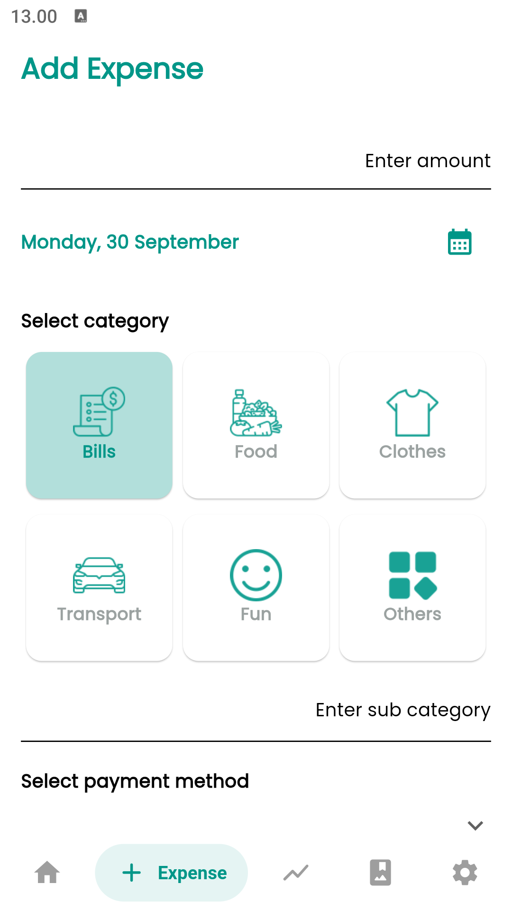
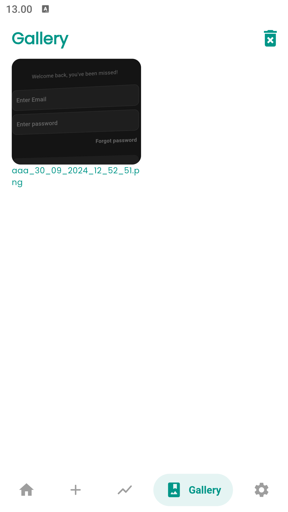

# Flutter Expense

A Flutter-based Expense tracking application that leverages Isar, a high-performance NoSQL database, for handling Create, Read, Update, and Delete (CRUD) operations. This app enables users to efficiently manage their expenses by adding, viewing, modifying, and deleting expense records, with Isar ensuring fast and seamless data storage and retrieval within the app.

## ✨ Features
- Expense Tracking: Add, view, update, and delete expense records.
- User-Friendly Interface: A clean and intuitive UI to easily manage expenses.
- Real-Time Updates: Leverages Isar for instant updates across the app.
- Theming: Custom fonts using Google Fonts for a modern look.
- Statistics & Indicators: Percent-based indicators to visualize expenses.
- Image Viewing: Allows users to view receipts or expense images with PhotoView.
- Tags Support: Easily categorize your expenses using tags.
- Bottom Navigation: Smooth navigation between different app sections using Salomon Bottom Bar.
- Offline Support: Isar ensures local storage, allowing the app to function without an internet connection.

## 🧩 Tech Stack
- Flutter: The mobile framework for cross-platform development.
- Isar: A high-performance database for handling CRUD operations.
- Flutter Riverpod: A state management solution for Flutter apps.
- GoRouter: A routing package for smooth navigation.
- Google Fonts: Custom fonts for a modern design.

## 🛠️ Installation
- Clone the Repository
- Setup Flutter and Dart SDK
- 0pen the project in Android Studio/ Vs Code with Flutter and Dart Extension
- Install Dependencies: After navigating to the project folder, install the necessary packages:
  ```
  flutter pub get
  ```
- Generate Isar Files: Run the build runner to generate Isar-related files for database access.
  ```
  flutter pub run build_runner build
  ```
- Run the App: Start the app using the following command:
  ```
  flutter run
  ```

## 📧 Contact
If you have any questions, feel free to reach out!
- Email: frank.jr.619@gmail.com
- GitHub: [@fjr619](https://github.com/fjr619)
- LinkedIn [franky-wijanarko](https://id.linkedin.com/in/franky-wijanarko)

## Screenshoot
<table>
  <tr>
    <th>Home</th>
    <th>Add expense</th>
    <th>Stats</th>
  </tr>
  <tr>
    <td></td>
    <td></td>
    <td></td>
  </tr>
    <tr>
    <th>Gallery</th>
    <th>Settings</th>
    <th>Search</th>
  </tr>
  <tr>
    <td></td>
    <td></td>
    <td></td>
  </tr>
</table>
